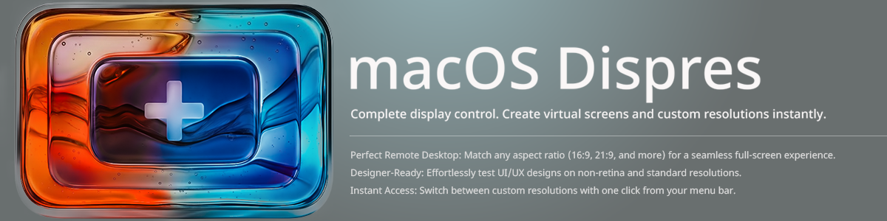
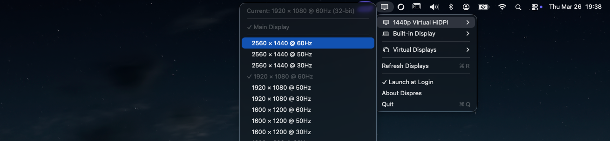
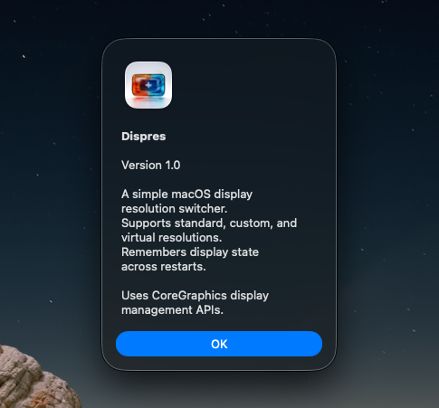

<p align="center">
  
</p>

# Dispres

A lightweight macOS menu bar utility for switching display resolutions, creating virtual displays, and managing multi-monitor setups.

Built for macOS 15+ (Sequoia/Tahoe). Runs natively on Apple Silicon and Intel.

## Features

### Resolution Switching
- Switch resolutions for any connected display from the menu bar
- Exposes **all available modes** including hidden ones macOS doesn't show in System Settings
- HiDPI (Retina) modes clearly labeled
- Current resolution shown with a checkmark

### Custom Resolutions
- Add custom resolution entries and attempt to apply them
- Searches all display modes (including hidden/unsafe ones) for matches
- Falls back to private CoreGraphics APIs for unsupported resolutions

### Virtual Displays
- Create virtual displays at any resolution (1080p, 1440p, 4K, ultrawide, or custom)
- **Perfect for remote desktop** — RustDesk, VNC, and other tools see virtual displays as real screens
- HiDPI support for virtual displays
- Auto-recreate on app launch
- Useful for headless Mac setups and clamshell mode with remote access

### Display Management
- Set any display as the **main display** directly from the menu (including virtual displays)
- Remembers display state (main display + resolutions) across restarts
- Auto-refreshes when displays are connected or disconnected

### System Integration
- Native menu bar icon — no dock icon, no windows
- Launch at Login support
- Lightweight and stays out of your way

## Installation

### From Source

Requires Xcode 16+ and macOS 15+.

```bash
git clone https://github.com/YOUR_USERNAME/macOS-Dispres.git
cd Dispres
./bundle.sh
```

This builds a release binary and creates `Dispres.app`. Then either:

```bash
# Copy to Applications
cp -r Dispres.app /Applications/

# Or just open it directly
open Dispres.app
```

### Development Build

```bash
swift build
.build/debug/Dispres
```

## Usage

1. Launch Dispres — a display icon appears in the menu bar
2. Click it to see all connected displays
3. Hover over a display to see available resolutions
4. Click a resolution to switch to it

<p align="center">
  
</p>

### Virtual Displays (for Remote Desktop)

If you need a resolution your physical display doesn't support (e.g., 2560x1440 for RustDesk on a 1080p monitor):

1. Click the menu bar icon
2. Go to **Virtual Displays** → **Create Virtual Display...**
3. Select a preset (1440p, 4K, etc.) or enter a custom resolution
4. Click **Create**

The virtual display appears as a real screen to macOS and remote desktop software. Enable **Auto-create on launch** to have it persist across restarts.

### Setting the Main Display

Each display submenu has a **Main Display** option. Click it to make that display the primary screen. This works for both physical and virtual displays.

<p align="center">
  
</p>

## Technical Details

- Uses CoreGraphics public APIs for display enumeration and resolution switching
- Uses `kCGDisplayShowDuplicateLowResolutionModes` to expose hidden display modes
- Virtual displays use the private `CGVirtualDisplay` API (macOS 14+)
- Private `CGSConfigureDisplayMode` API as fallback for custom resolutions
- Display state is persisted using stable identifiers (vendor/model/serial) that survive reboots
- No sandbox — required for CoreGraphics display configuration APIs

### Project Structure

```
Sources/
├── CGVirtualDisplayBridge/     # ObjC headers for private CGVirtualDisplay API
│   ├── include/
│   │   └── CGVirtualDisplayBridge.h
│   └── CGVirtualDisplayBridge.m
└── Dispres/
    ├── DispresApp.swift            # App entry point, MenuBarExtra, AppDelegate
    ├── Models/
    │   └── DisplayModels.swift     # DisplayInfo, DisplayModeInfo, CustomResolution
    ├── Services/
    │   ├── DisplayManager.swift    # Display enumeration, mode switching, state persistence
    │   ├── VirtualDisplayService.swift  # Virtual display lifecycle management
    │   ├── LoginItemService.swift  # Launch at Login (SMAppService / LaunchAgent)
    │   └── PrivateAPIs.swift       # CGS private API declarations
    └── Views/
        ├── MenuContentView.swift        # Top-level menu
        ├── DisplaySectionView.swift     # Per-display submenu
        ├── VirtualDisplayView.swift     # Virtual display menu + create form
        └── CustomResolutionSheet.swift  # Custom resolution form
```

## Limitations

- **Bit depth** is read-only on modern macOS — Apple Silicon doesn't allow programmatic changes
- **Custom resolutions** only work if the display hardware supports them at some level. You can't force a 1080p panel to physically output 4K
- **Virtual displays** require macOS 14+ and use private APIs that may change between OS versions
- **Not for App Store** — this app uses private CoreGraphics APIs (`CGVirtualDisplay`, `CGSConfigureDisplayMode`) that Apple does not allow on the App Store
- **Launch at Login** via `SMAppService` requires running from the `.app` bundle

## License

GPL-3.0 — see [LICENSE](LICENSE)

This project uses private macOS APIs and is not suitable for App Store distribution.
