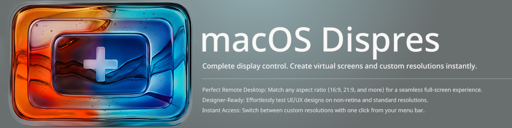
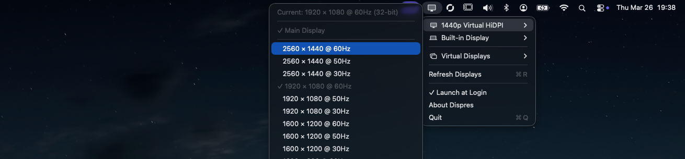
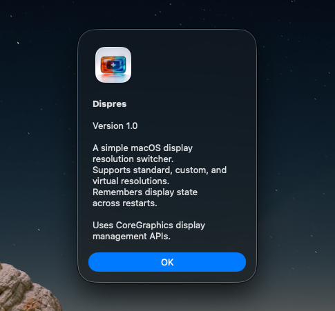

<p align="center">
  
</p>

# Dispres

A lightweight macOS menu bar utility for switching display resolutions, creating virtual displays, and managing multi-monitor setups.

Built for macOS 15+ (Sequoia/Tahoe). Runs natively on Apple Silicon and Intel.

## Features

### Resolution Switching
- Switch resolutions for any connected display from the menu bar
- Exposes **all available modes** including hidden ones macOS doesn't show in System Settings
- HiDPI (Retina) modes clearly labeled
- Current resolution shown with a checkmark

### Custom Resolutions
- Add custom resolution entries and attempt to apply them
- Searches all display modes (including hidden/unsafe ones) for matches
- Falls back to private CoreGraphics APIs for unsupported resolutions

### Virtual Displays
- Create virtual displays at any resolution (1080p, 1440p, 4K, ultrawide, or custom)
- **Perfect for remote desktop** — RustDesk, VNC, and other tools see virtual displays as real screens
- HiDPI support for virtual displays
- Auto-recreate on app launch
- Useful for headless Mac setups and clamshell mode with remote access

### Clamshell Mode (Lid Closed, Remote Only)
- Keep using a MacBook over RustDesk/VNC with the **lid shut** — no external display or dummy HDMI plug needed
- Closing the lid brings up your virtual display and hands it the menu bar automatically
- Opening the lid tears it down and returns the built-in panel to main, so every window comes back with it
- **⌃⌥⌘D** recovers from anywhere — including when the menu bar is stranded on a screen you can't see
- Arms itself on a cold start too, so a login-item launch with the lid already closed works

### Display Management
- Set any display as the **main display** directly from the menu (including virtual displays)
- Remembers display state (main display + resolutions) across restarts
- Auto-refreshes when displays are connected or disconnected

### System Integration
- Native menu bar icon — no dock icon, no windows
- Launch at Login support
- Lightweight and stays out of your way

## Installation

### From Source

Requires Xcode 16+ and macOS 15+.

```bash
git clone https://github.com/adevra/macOS-Dispres.git
cd macOS-Dispres
./bundle.sh
```

This builds a release binary and creates `Dispres.app`. Then either:

```bash
# Copy to Applications
cp -r Dispres.app /Applications/

# Or just open it directly
open Dispres.app
```

### Development Build

```bash
swift build
.build/debug/Dispres
```

## Usage

1. Launch Dispres — a display icon appears in the menu bar
2. Click it to see all connected displays
3. Hover over a display to see available resolutions
4. Click a resolution to switch to it

<p align="center">
  
</p>

### Virtual Displays (for Remote Desktop)

If you need a resolution your physical display doesn't support (e.g., 2560x1440 for RustDesk on a 1080p monitor):

1. Click the menu bar icon
2. Go to **Virtual Displays** → **Create Virtual Display...**
3. Select a preset (1440p, 4K, etc.) or enter a custom resolution
4. Click **Create**

The virtual display appears as a real screen to macOS and remote desktop software. Enable **Auto-create on launch** to have it persist across restarts.

### Setting the Main Display

Each display submenu has a **Main Display** option. Click it to make that display the primary screen. This works for both physical and virtual displays.

<p align="center">
  
</p>

### Clamshell Mode (Lid Closed + Remote Desktop)

For running a MacBook headless over RustDesk or VNC with the lid shut and no external display attached.

First, stop macOS sleeping when the lid closes:

```bash
sudo pmset -a disablesleep 1
```

Then create a virtual display at the resolution you want to work at, with **Auto-create on launch** enabled. From then on:

- **Close the lid** — Dispres creates the virtual display if it isn't already up and makes it the main display, so your remote session switches to that resolution
- **Open the lid** — the virtual display is removed and the built-in panel becomes main again, bringing your windows back
- **⌃⌥⌘D** — global hot key that runs the same recovery by hand

Turn the behaviour off with **Auto-Switch Virtual Display on Lid Close/Open** in the menu.

To undo the sleep change afterwards: `sudo pmset -a disablesleep 0`. It applies on battery too, so the Mac won't sleep unplugged until you do.

> **Why this exists:** a virtual display left as main while the lid is shut keeps the menu bar and every window after you reopen the lid. The built-in panel comes back showing an empty desktop, nothing is clickable, and the menu bar icon that would undo it is itself off-screen. Recovering from that used to mean a hard restart.

## Technical Details

- Uses CoreGraphics public APIs for display enumeration and resolution switching
- Uses `kCGDisplayShowDuplicateLowResolutionModes` to expose hidden display modes
- Virtual displays use the private `CGVirtualDisplay` API (macOS 14+)
- Private `CGSConfigureDisplayMode` API as fallback for custom resolutions
- Display state is persisted using stable identifiers (vendor/model/serial) that survive reboots
- Lid state comes from `IOPMrootDomain`'s `AppleClamshellState`, via an IOKit interest notification plus a 1s poll (the property lags the physical lid, so a single read on the notification drops edges)
- The recovery hot key uses Carbon `RegisterEventHotKey`, so it needs no Accessibility permission and still fires when the menu bar is unreachable
- Virtual displays are only ever made main `.forSession`, never `.permanently`, so they can't be written into the saved display arrangement
- No sandbox — required for CoreGraphics display configuration APIs

### Project Structure

```
Sources/
├── CGVirtualDisplayBridge/     # ObjC headers for private CGVirtualDisplay API
│   ├── include/
│   │   └── CGVirtualDisplayBridge.h
│   └── CGVirtualDisplayBridge.m
└── Dispres/
    ├── DispresApp.swift            # App entry point, MenuBarExtra, AppDelegate
    ├── Models/
    │   └── DisplayModels.swift     # DisplayInfo, DisplayModeInfo, CustomResolution
    ├── Services/
    │   ├── AppServices.swift       # Service container, bootstrapped at launch
    │   ├── DisplayManager.swift    # Display enumeration, mode switching, state persistence
    │   ├── VirtualDisplayService.swift  # Virtual display lifecycle management
    │   ├── RecoveryService.swift   # Clamshell monitor, lid handling, recovery hot key
    │   ├── LoginItemService.swift  # Launch at Login (SMAppService / LaunchAgent)
    │   └── PrivateAPIs.swift       # CGS private API declarations
    └── Views/
        ├── MenuContentView.swift        # Top-level menu
        ├── DisplaySectionView.swift     # Per-display submenu
        ├── VirtualDisplayView.swift     # Virtual display menu + create form
        └── CustomResolutionSheet.swift  # Custom resolution form
```

## Limitations

- **Bit depth** is read-only on modern macOS — Apple Silicon doesn't allow programmatic changes
- **Custom resolutions** only work if the display hardware supports them at some level. You can't force a 1080p panel to physically output 4K
- **Virtual displays** require macOS 14+ and use private APIs that may change between OS versions
- **Not for App Store** — this app uses private CoreGraphics APIs (`CGVirtualDisplay`, `CGSConfigureDisplayMode`) that Apple does not allow on the App Store
- **Launch at Login** via `SMAppService` requires running from the `.app` bundle
- **Clamshell mode** needs `sudo pmset -a disablesleep 1` — without an external display macOS sleeps on lid close regardless. This also stops the Mac sleeping on battery until you revert it
- **FileVault + clamshell**: if the Mac reboots with the lid shut you land at the pre-boot unlock screen, where nothing is running and remote access isn't possible yet

## License

GPL-3.0 — see [LICENSE](LICENSE)

This project uses private macOS APIs and is not suitable for App Store distribution.
